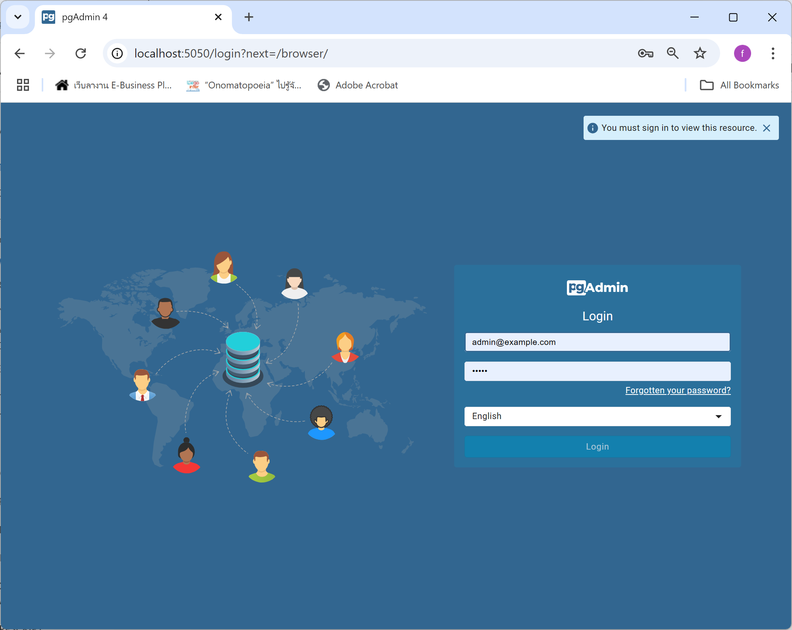
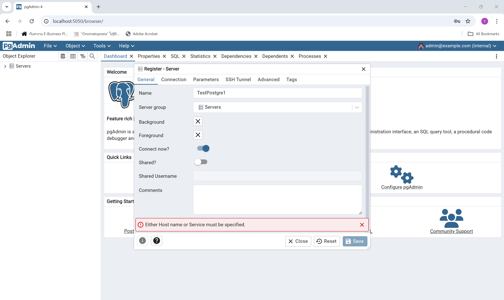
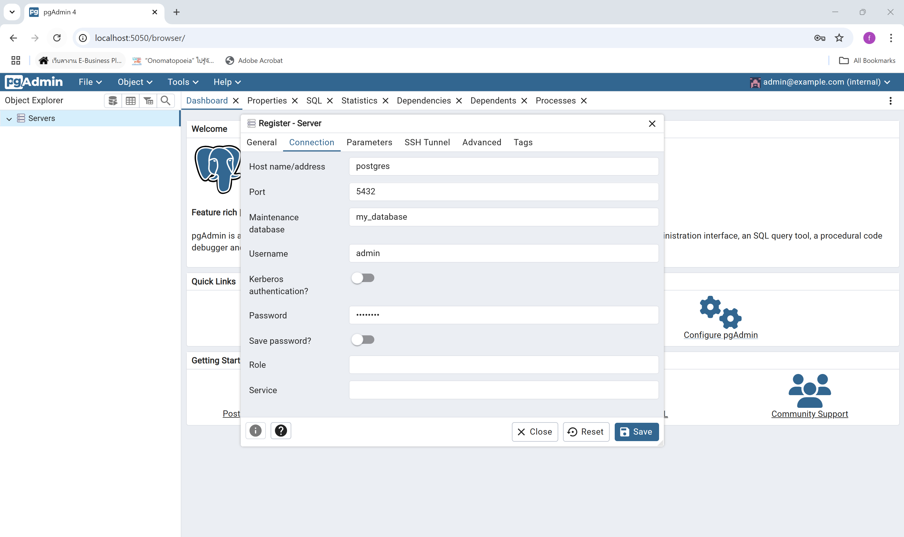

### **Postgres-docker-readme.md**

---

# การตั้งค่าและใช้งาน PostgreSQL และ pgAdmin ด้วย Docker Compose

## **1. แนะนำ**
ไฟล์ `docker-compose.yml` นี้ถูกออกแบบมาเพื่อช่วยให้คุณสามารถติดตั้งและใช้งาน **PostgreSQL** และ **pgAdmin** ได้ง่ายๆ ผ่าน Docker Compose โดยใช้ Time Zone ประเทศไทย (**Asia/Bangkok**) และเก็บข้อมูลถาวรในโฟลเดอร์ของเครื่องคุณเอง

---

## **2. ข้อมูลของบริการ**

### **PostgreSQL**
- **Image**: postgres:latest  
  ใช้ PostgreSQL เวอร์ชันล่าสุด
- **Environment Variables**:
  - `POSTGRES_USER`: ชื่อผู้ใช้งาน (ค่าเริ่มต้น: `admin`)
  - `POSTGRES_PASSWORD`: รหัสผ่านของผู้ใช้ (ค่าเริ่มต้น: `admin123`)
  - `POSTGRES_DB`: ชื่อฐานข้อมูลเริ่มต้น (ค่าเริ่มต้น: `my_database`)
  - `TZ`: ตั้ง Time Zone เป็นเวลาไทย (`Asia/Bangkok`)
- **พอร์ตที่เปิดใช้งาน**:  
  PostgreSQL จะเปิดให้ใช้งานผ่านพอร์ต `15432` (ของเครื่องคุณ) ไปยัง `5432` (ภายในคอนเทนเนอร์)

---

### **pgAdmin**
- **Image**: dpage/pgadmin4:latest  
  ใช้ pgAdmin เวอร์ชันล่าสุด
- **Environment Variables**:
  - `PGADMIN_DEFAULT_EMAIL`: อีเมลสำหรับเข้าใช้งาน pgAdmin (ค่าเริ่มต้น: `admin@example.com`)
  - `PGADMIN_DEFAULT_PASSWORD`: รหัสผ่านของ pgAdmin (ค่าเริ่มต้น: `admin`)
  - `TZ`: ตั้ง Time Zone เป็นเวลาไทย (`Asia/Bangkok`)
- **พอร์ตที่เปิดใช้งาน**:  
  pgAdmin จะเปิดให้ใช้งานผ่านพอร์ต `5050` (ของเครื่องคุณ) ไปยัง `80` (ภายในคอนเทนเนอร์)
- **ขึ้นอยู่กับ PostgreSQL**: pgAdmin จะเริ่มทำงานหลังจาก PostgreSQL พร้อมใช้งาน (`depends_on`)






---

## **3. โครงสร้างโฟลเดอร์**
- **`./data/postgres`**  
  โฟลเดอร์นี้ใช้เก็บข้อมูลของ PostgreSQL เพื่อให้ข้อมูลไม่สูญหายเมื่อหยุดคอนเทนเนอร์
- **`./data/pgadmin`**  
  โฟลเดอร์นี้ใช้เก็บการตั้งค่าของ pgAdmin เช่น การเชื่อมต่อฐานข้อมูล

---

## **4. วิธีการใช้งาน**

### **4.1 ติดตั้ง Docker และ Docker Compose**
หากยังไม่ได้ติดตั้ง Docker และ Docker Compose:
- [Docker Installation Guide](https://docs.docker.com/get-docker/)
- [Docker Compose Installation Guide](https://docs.docker.com/compose/install/)

---

### **4.2 รันคอนเทนเนอร์**
1. เปิด Terminal หรือ Command Prompt
2. ไปยังโฟลเดอร์ที่เก็บไฟล์ `docker-compose.yml`
3. ใช้คำสั่ง:
   ```bash
   docker-compose up -d
   ```
   - คำสั่งนี้จะรัน PostgreSQL และ pgAdmin ในโหมดเบื้องหลัง (`-d`)

---

### **4.3 เข้าถึงบริการ**

#### **PostgreSQL**
- **Host**: `localhost`
- **Port**: `15432`
- **Username**: `admin`
- **Password**: `admin123`
- **Database Name**: `my_database`

#### **pgAdmin**
1. เปิดเบราว์เซอร์และเข้าที่:  
   ```plaintext
   http://localhost:5050
   ```
2. เข้าสู่ระบบด้วย:
   - **Email**: `admin@example.com`
   - **Password**: `admin`

3. เพิ่มการเชื่อมต่อไปยัง PostgreSQL ใน pgAdmin:
   - **Host**: `postgres`
   - **Port**: `5432`
   - **Username**: `admin`
   - **Password**: `admin123`

---

## **5. คำสั่งที่มีประโยชน์**

### **ตรวจสอบสถานะของคอนเทนเนอร์**
```bash
docker-compose ps
```

### **หยุดคอนเทนเนอร์**
```bash
docker-compose down
```

### **หยุดคอนเทนเนอร์และลบข้อมูล**
```bash
docker-compose down -v
```

---

## **6. หมายเหตุ**
- หากต้องการเปลี่ยนแปลงการตั้งค่า เช่น ชื่อผู้ใช้หรือรหัสผ่าน ให้แก้ไขไฟล์ `docker-compose.yml` แล้วรันคำสั่ง:
  ```bash
  docker-compose up -d
  ```

- หากข้อมูลสูญหาย ให้ตรวจสอบว่าโฟลเดอร์ `./data/postgres` และ `./data/pgadmin` ถูกสร้างขึ้นหรือไม่

---

## **7. ปัญหาที่พบบ่อย**

### **1. pgAdmin เข้าไม่ได้**
- ตรวจสอบว่า PostgreSQL ทำงานปกติหรือไม่:
  ```bash
  docker logs postgres
  ```
- รีสตาร์ทบริการ:
  ```bash
  docker-compose restart
  ```

### **2. PostgreSQL ไม่เชื่อมต่อ**
- ตรวจสอบค่าการเชื่อมต่อใน pgAdmin ให้ตรงกับการตั้งค่าใน `docker-compose.yml`

---

## **8. สรุป**
ไฟล์ `docker-compose.yml` นี้ช่วยให้การติดตั้งและใช้งาน PostgreSQL และ pgAdmin ง่ายและรวดเร็ว โดยมีการตั้งค่า Time Zone เป็นเวลาไทย (Asia/Bangkok) และเก็บข้อมูลถาวรในโฟลเดอร์ของเครื่อง หากมีคำถามเพิ่มเติม คุณสามารถแก้ไขหรือปรับปรุงไฟล์นี้ได้ตามต้องการ 😊

---